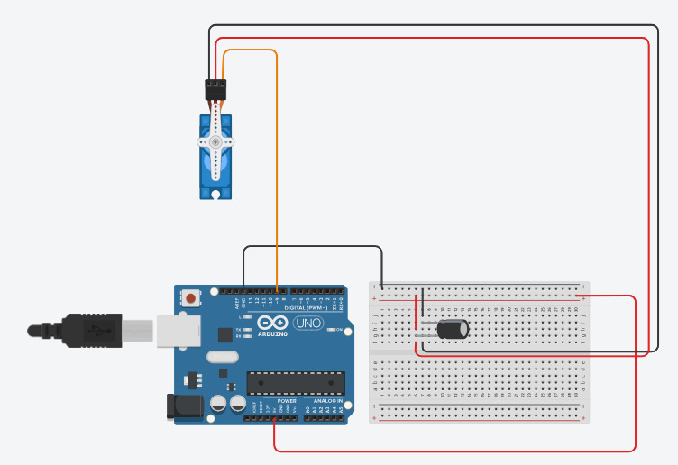

# Documentatie Arm Opdracht 1

Geschreven door Aghiad en Jay

## Setup

### Hardware

Om de arm opdracht op te zetten is er de volgende hardware nodig:
* Arduino Uno R3
* Servomotor
* Condensator
* Draden

Deze componenten moeten op de volgende wijze samengevoegd worden:


### Software

Om de software op de hardware te installeren, moeten de volgende stappen gevolgd worden:
1. Verbindt de Arduino Uno R3 met uw computer via USB.
2. Voer het volgende commando uit in de linux terminal: `sudo chmod 777 /dev/ttyACM0`.
3. Open `main.ino` met de Arduino IDE.
4. Selecteer de juiste USB poort.
5. Klik op "Upload".

## Gebruik

### Algemeen

Alle commando's die naar de arm gestuurd worden, moeten verstuurd worden via de seriele USB poort. Dit kan via de Arduino IDE.

### Positie Veranderen

De commando om de positie van de arm te veranderen heeft de volgende syntax:

```
position: x
```

Deze commando zet de positie van de arm meteen op `x` graden.

### Positie Veranderen over Tijd

De commando om de positie van de arm te veranderen over een bepaalde tijd heeft de volgende syntax:

```
position: x duration: y
```

Deze commando zet de positie van de arm op `x` graden over `y` aantal seconden.